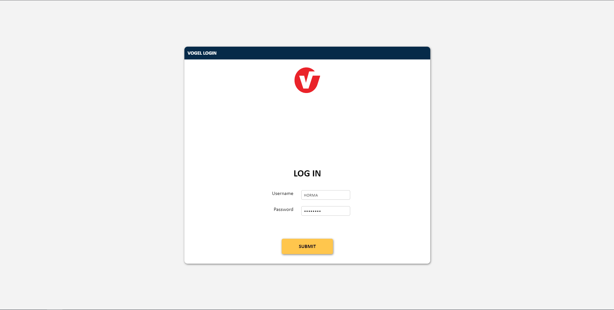
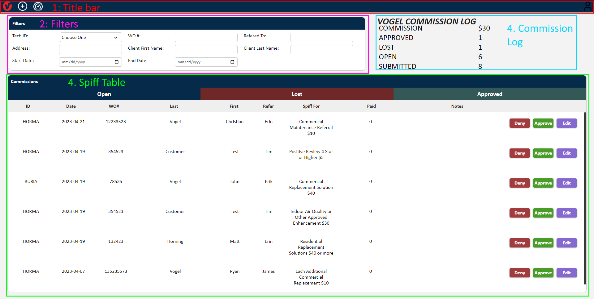
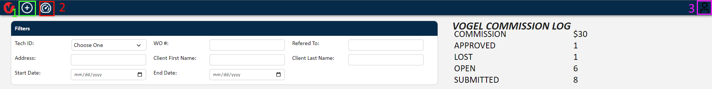
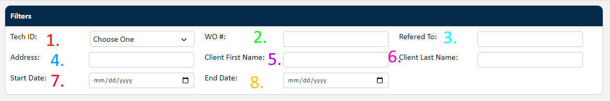
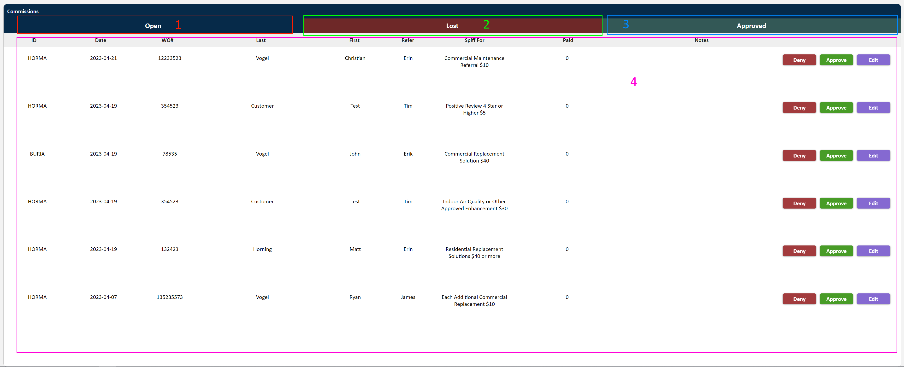
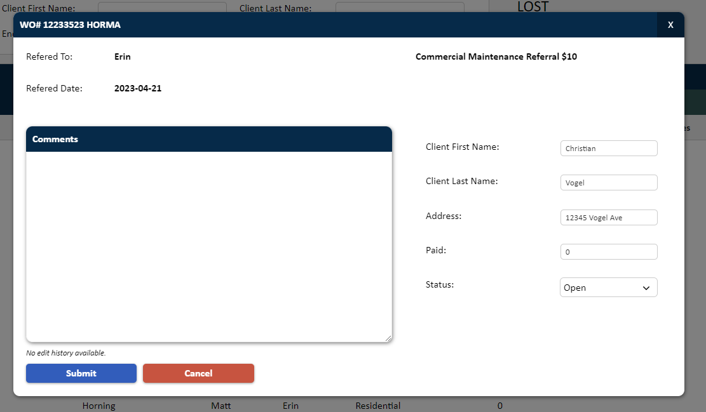
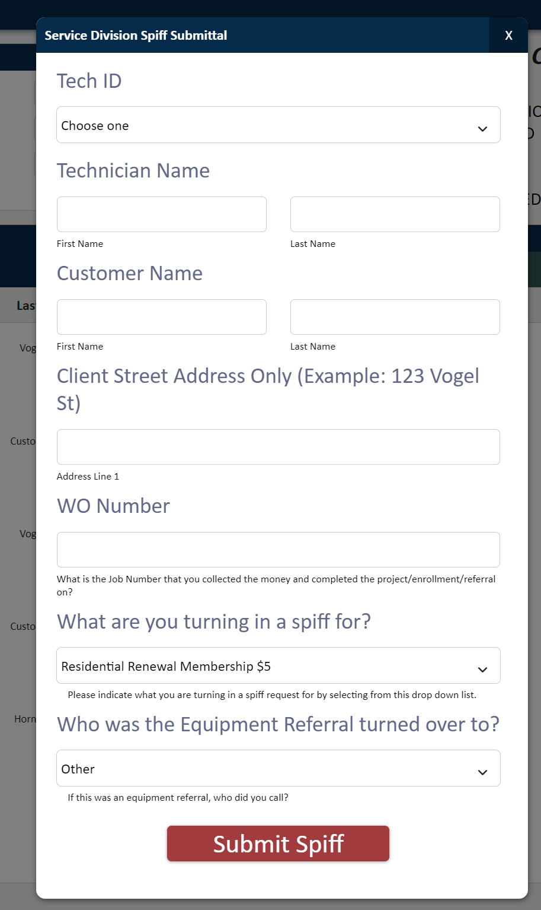

# Spiff Manager Application

An application for managing and approving Spiffs.

To start using the application, enter your username and password in the screen below:

Now that you are logged in, you will see the below screen:

This screen has four components, which are labeled in the image.

1. Title Bar
2. Filters
3. Commission Log
4. Spiff Table

### Title Bar

From the Title Bar, you can access the following actions as shown in the image.

1. Add New Spiff - This opens a form which allows you to submit a Spiff for any of the technicians.

2. Reporting - This allows you to access the ***Reporting*** component of the application.

3. User Information - This allows you to view your user information and log out of the application in case you need to login as a different user.

### Filters

There are filters for the different properties of the Spiffs. You can in the following ways.

#### Basic Filtering

1. ***Tech ID*** - This is a searchable list of all of the Techs and users associated with the application.

2. ***WO #*** - This is the WO number associated with a spiff.

3. ***Refered To*** - The name of the person the Spiff was referred to.

4. ***Address*** - This is the Address associated with a spiff.

5. ***Client First Name*** - The first name of the client on the spiff.

6. ***Client Last Name*** - The last name of the client on the spiff.

#### Advanced Filtering

You can also filter by a date range by using the ***7. Start Date*** and ***8. End Date*** filters. Filtering by a date range will display only the Spiffs that fall within the date range. If you do not give an end date, it will show all Spiffs from the start date until the current date.

### Commission Log

The commission log keeps a running total of all currently open, lost, and approved spiffs, and their respective total commission amounts. This data will also be display on the report.

### Spiff Table

The spiff table is made of two basic components, a tab bar (1 - 3) and the table itself (4). There are three tabs.

1. Open - This allows viewing Spiffs with an open status.

2. Lost - This allows viewing Spiffs with a lost status.

3. Approved - This allows viewing Spiffs with an approved status.

The spiff table is a list of Spiffs within the selected status category. It lists a set of information associated with the Spiff, and a set of actions depending on the status of the spiff.

### Editing A Spiff

When you click "Edit", "Deny", or "Approve" on a spiff, it will open the above edit form. When using "Deny" or "Approve", it will automatically change the status to "Lost" or "Approved".

In order to submit a spiff to "Approved" status, the paid amount must be greater than zero. In order to submit a spiff to "Lost" status, the paid amount must be exactly zero.

### Creating a new Spiff

By clicking on the + icon in the titlebar, you can submit a new spiff using the form shown below. This form allows you to search for a user who the spiff will be submitted for, and filling out the form for that user.

## Reporting